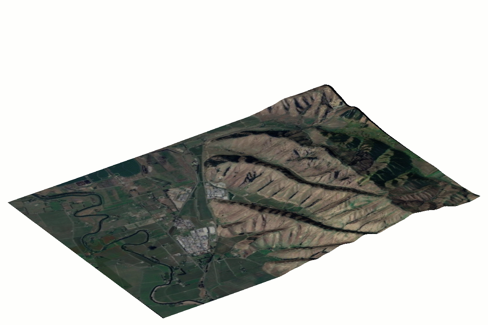

Z Scale TIN Surfaces (from https://www.cadconcepts.co.nz/resources/z-scale-tin-surfaces)

Copies and scales the elevation (Z values) of selected BricsCAD TIN Surfaces.

NOTE. You need to have BricsCAD Pro V21 or greater to use this tool.

Command(s):
ZZTIN

Use
Select the TIN Surfaces you want to work, then enter a scale factor. A copy of the TIN will be created at the given scale on its own layer named after the source TIN Layer suffixed with the scale factor. ‍

*********************************************************
Português:
Escala em Z Superfícies TIN, terrenos

Copia e escala a elevação (valores Z) das Superfícies TIN selecionadas no BricsCAD.

NOTA: Você precisa ter o BricsCAD Pro V21 ou superior para usar esta ferramenta.

Comando(s): ZZTIN

Uso: Selecione as Superfícies TIN com as quais você deseja trabalhar e insira um fator de escala. Uma cópia do TIN será criada na escala dada em sua própria camada, nomeada com o sufixo do fator de escala da camada do TIN original.

*********************************************************
Español:
Escala en Z superfícies TIN, terrenos

Copia y escala la elevación (valores Z) de las Superficies TIN seleccionadas en BricsCAD.

NOTA: Necesitas tener BricsCAD Pro V21 o superior para usar esta herramienta.

Comando(s): ZZTIN

Uso: Selecciona las Superficies TIN con las que deseas trabajar, luego ingresa un factor de escala. Se creará una copia del TIN a la escala dada en su propia capa, nombrada con el sufijo del factor de escala de la capa del TIN original.

