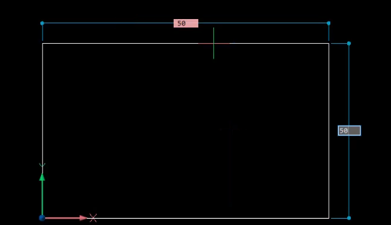
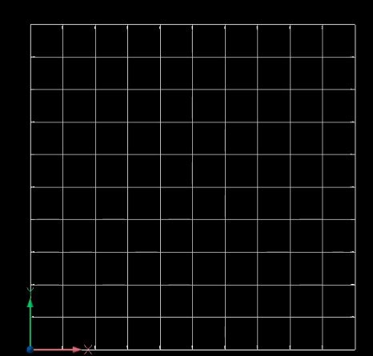
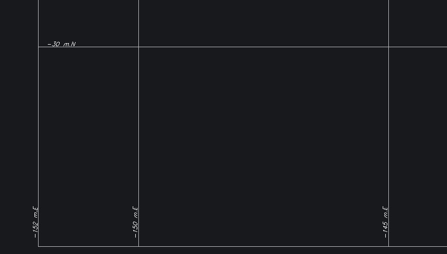
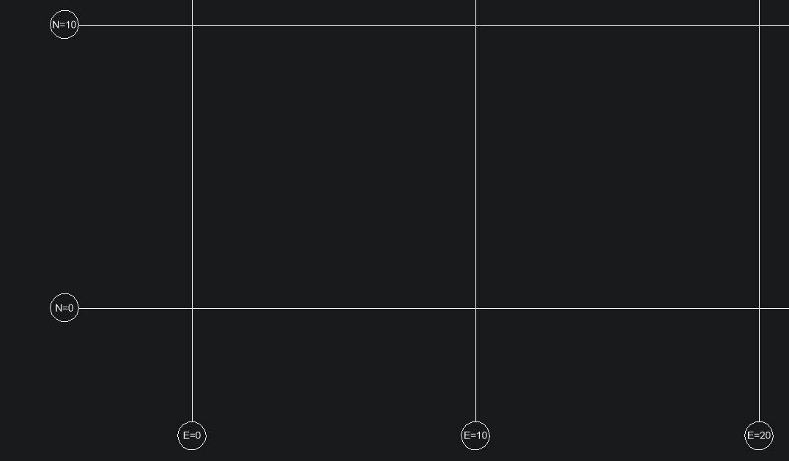

This routines will automatically draw a grid with the coordinates in AutoCAD or BricsCAD.

To use it AutomaticGrid1:

-> Load the lisp routine
-> Draw a rectangle, for example 50x50

-> In the Select View, select the rectangle
-> Choose if you want to rotate to North and East (Yes or No)
-> The grid is done

The coordinates are also inserted:

In BricsCAD, there is the command BIMGRID that draw it automatically, without routines.

